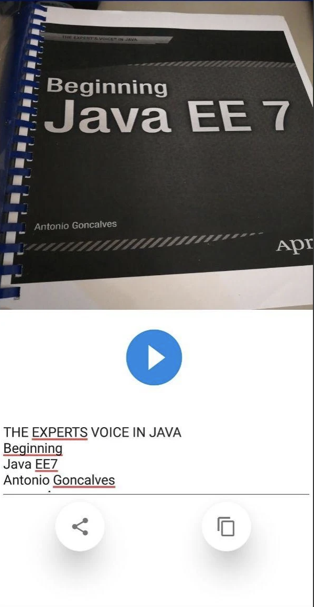
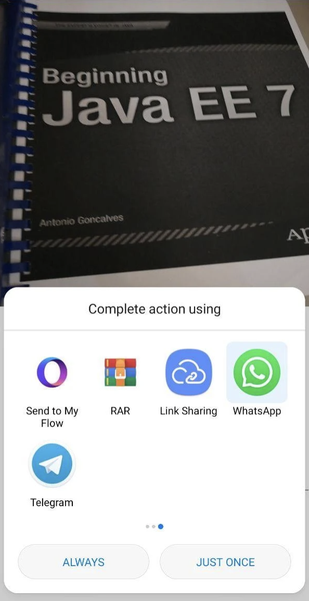

# Camera-Text-Vision
Android app published on Google Play Store. It consists of a tool app that allows to scan in real-time the text displayed by the smartphone camera, using Google Cloud Vision API.
 
Google Play: https://cutt.ly/VnPOBKq

 

  
  

#### This app has following packages:
1. **ui**: View classes along with their corresponding Presenter.
2. **utils**: Utility classes.

#### This is a MVC Java Project
- I used Google Cloud Vision API to scan text in real-time
- I used Google Mobile Ads to show banner and interstitial

 

  

